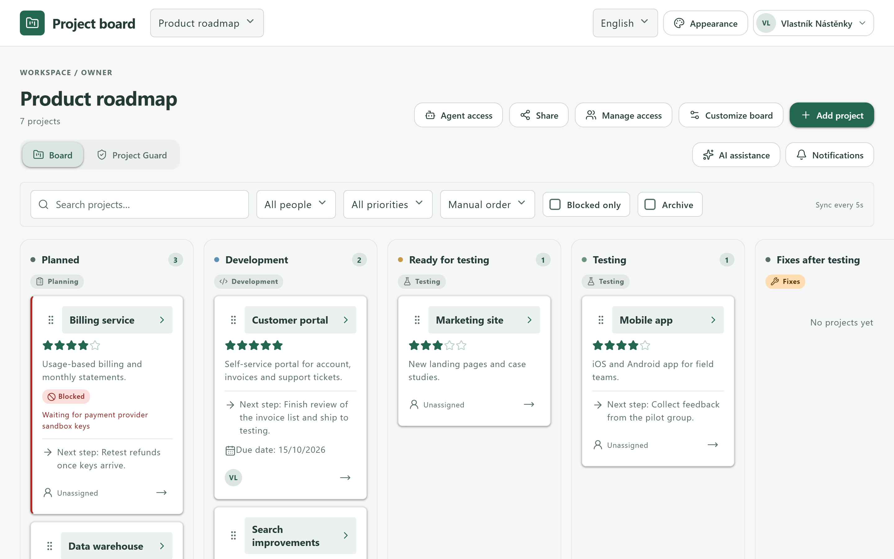
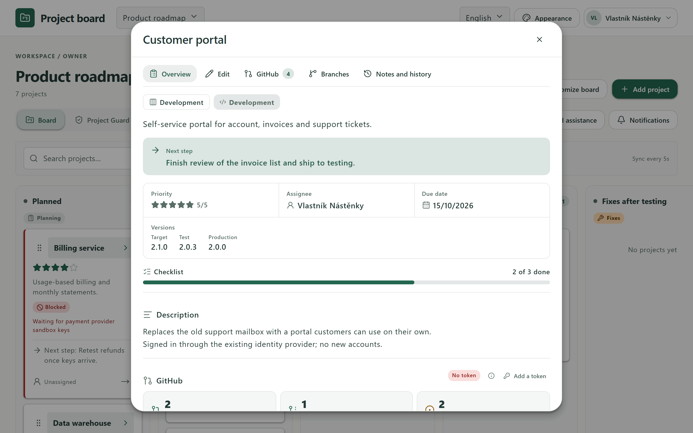
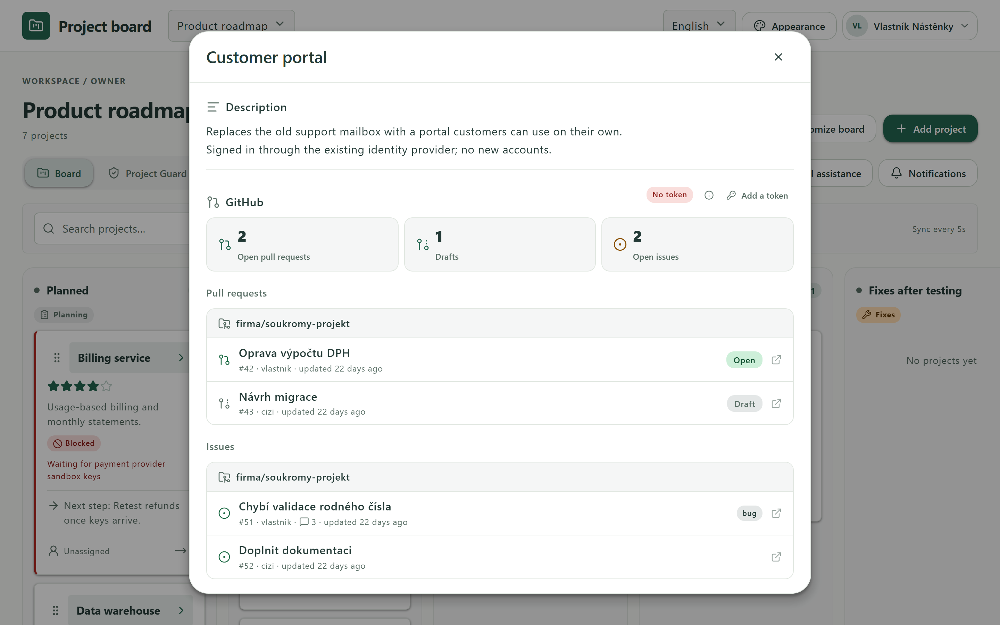
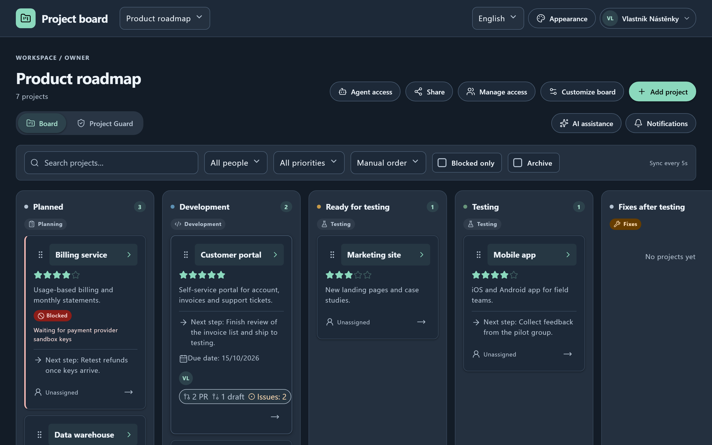
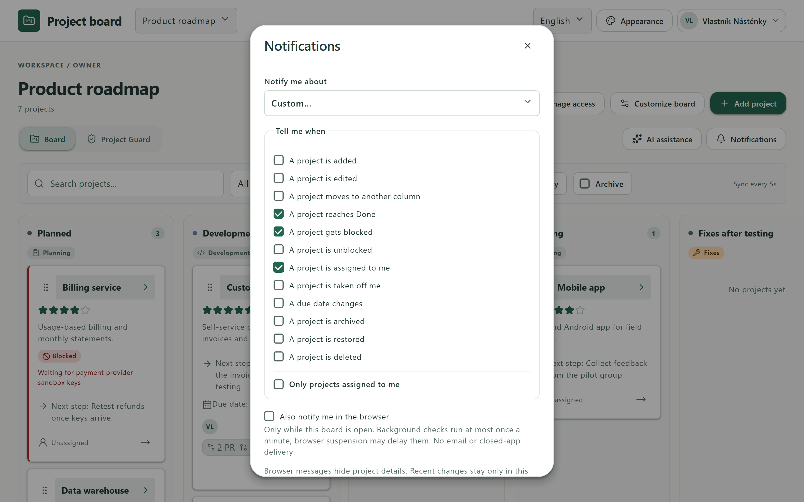
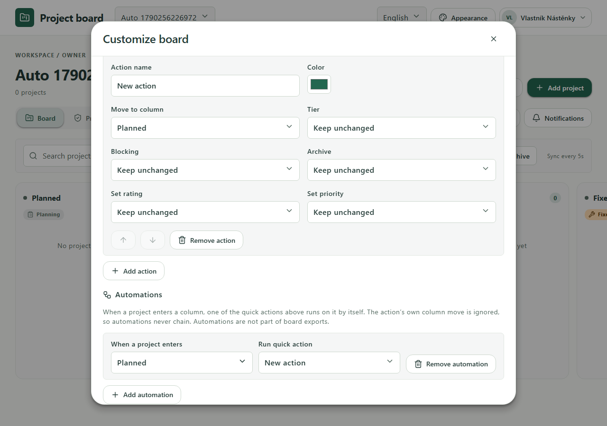
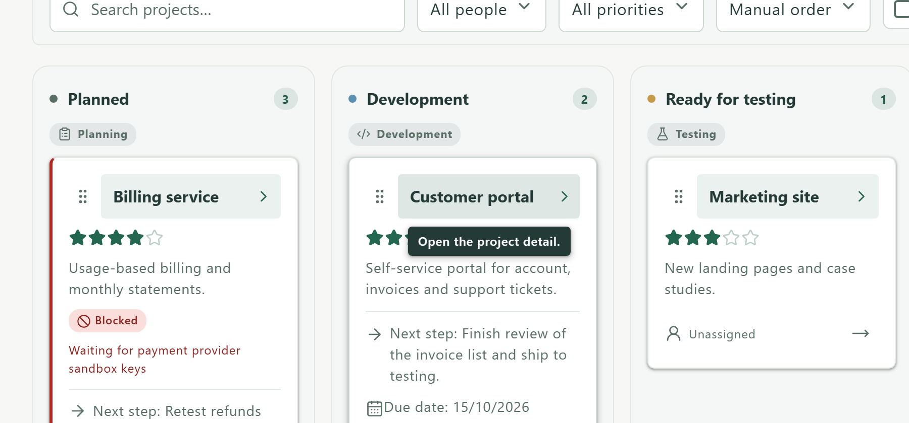
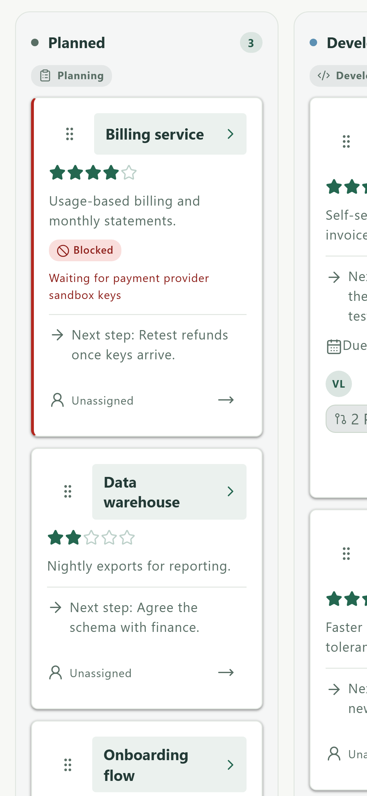

# Project board

**A private project board that keeps the phase a project is in separate from the
versions that are deployed.** Each project is one card that moves through your
own workflow columns, while its target, test and production versions stay
visible on their own, so a project can be in testing with 1.4 while 1.3 runs in
production.

- **Live app:** https://project-board.majkeylab.workers.dev (sign in with GitHub)
- **Project page:** https://majkey25.github.io/project-board-showcase/

This repository is a showcase: documentation and screenshots only. The source
code is private.

*All screenshots show a synthetic demo board.*

## What it does

**Boards and projects**
- Private boards with editable workflow columns, each mapped to a stage such as
  planning, development, testing, production or done.
- Projects carry a summary, description, next step, owner, due date, blocking
  reason, target, test and production versions, a checklist, notes, a 1–5 star
  priority, custom fields, tiers and ratings, plus a full change history.
- A project overview built for scanning: status, next step, the key facts,
  checklist progress and what is open on GitHub, at a glance.
- Drag and drop, keyboard moves, search and filters by person, priority, tier
  and blocked state.

**Working together**
- Owner, administrator, editor and viewer roles. Administrators can do
  everything except delete the board or change who owns it.
- Invite people by GitHub username or with invitation links that can expire,
  have a use limit and be revoked.
- Custom notifications: choose exactly which events notify you (added, edited,
  moved, reached Done, blocked, assigned to you, due date changed, …).
- Quick actions apply several changes at once, and **automations** run one
  whenever a project enters a chosen column.

**GitHub, agents and AI**
- Link repositories to projects and see their pull requests, issues and
  branches. Each person sees only what their own GitHub account can see.
- **Project Guard** audits the issues and pull requests you can access against
  rules you set, and prepares changes you review before anything is applied.
- **Agent access:** scoped, expiring API tokens with a documented API, so AI
  agents and scripts can read or update a board without ever exceeding the
  permissions of the person who created them.
- **AI assistance** with your own OpenAI or Azure OpenAI key. You choose what
  context is sent; nothing is sent by just opening a board.

**Experience**
- Six built-in themes, each with a light and a dark palette, plus a custom one.
- English and Czech. Hover hints explain every control and can be switched off.
- Works on phones and installs as an app from the browser.

## Screenshots

| | |
| --- | --- |
|  |  |
| **Project overview**: status, next step, facts and checklist progress | **GitHub**: open pull requests and issues, per repository |
|  |  |
| **Dark theme** (Midnight) | **Custom notifications** |
|  |  |
| **Automations** in Customize board | **Hover hints** in the app's language |

## How it is built

- **Frontend:** React 19, TypeScript (strict) and Vite, following Material
  Design 3 tokens, with a service worker for installation.
- **Backend:** a Cloudflare Worker with a JSON API and Cloudflare D1 (SQLite).
- **Sign-in:** a GitHub App (OAuth with PKCE); optional personal tokens for
  wider GitHub access, used only for the person who saved them.
- **Quality:** hundreds of automated unit and API tests, a browser end-to-end
  suite and continuous integration on every change, plus encrypted backup and
  restore tooling that is rehearsed before every database migration.

## Security and privacy

- Board content is encrypted at rest with AES-256-GCM. The keys live outside
  the database, so a leaked database dump does not reveal board content. This
  is server-side encryption, not end-to-end encryption.
- GitHub tokens are encrypted and never sent back to the browser. Every GitHub
  read uses the visitor's own access, so sharing a board never shares anyone's
  GitHub permissions.
- Strict Content Security Policy, HSTS, same-origin checks, rate limits and
  database-level guards against stale or unencrypted writes.
- Agent tokens are stored only as hashes, limited to one board and to an
  explicit list of operations, and every agent change is recorded.
- Project Guard results and proposals are personal and never shared.

## Status

A working pilot. The live app is open for sign-in with GitHub; boards are
private to their members. It is provided as is, under the terms of use shown
in the app.

## Licence

Proprietary. All rights reserved. See [LICENSE](LICENSE). The source code is
not published.

---

Made by [Matěj Teplý](https://github.com/Majkey25).
