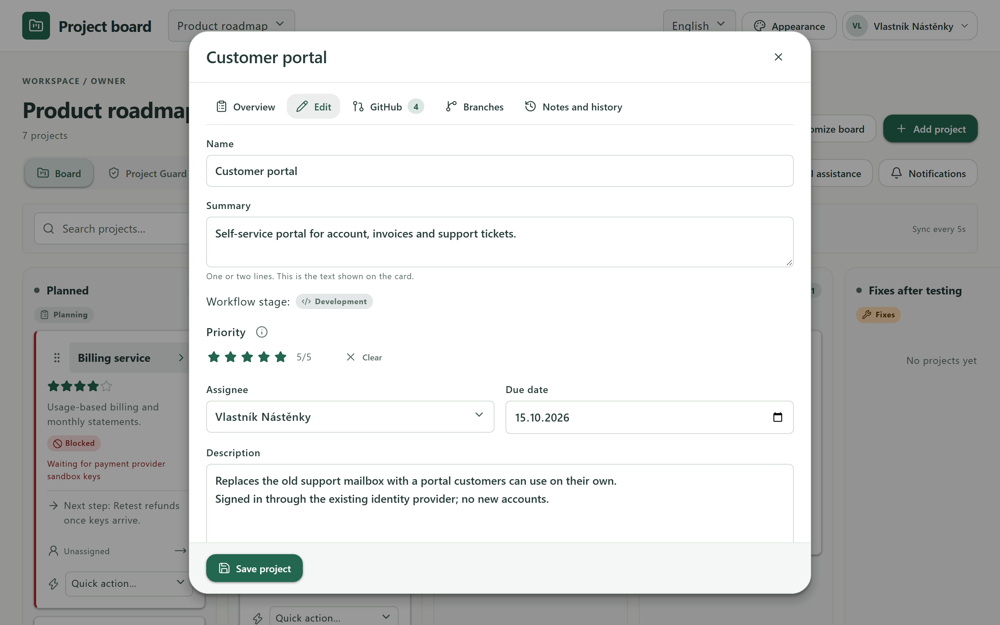
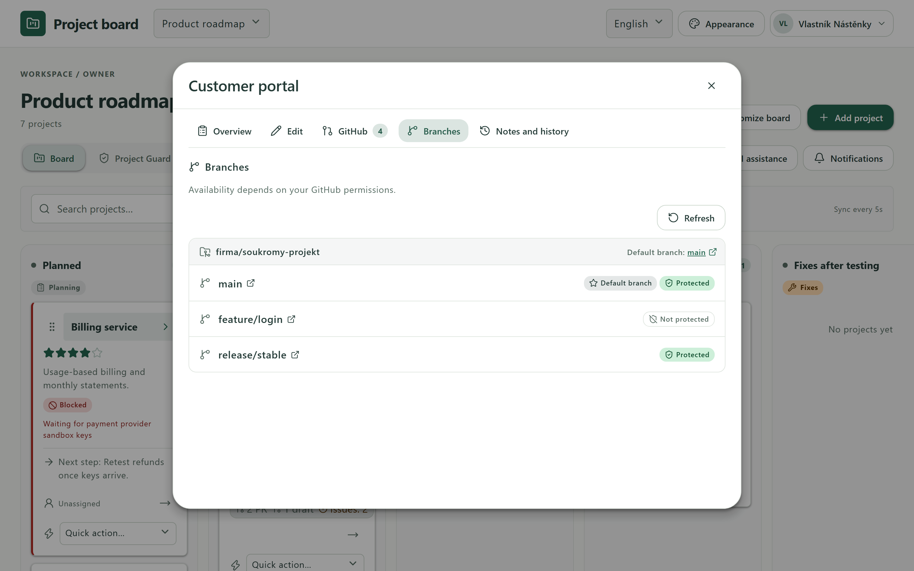
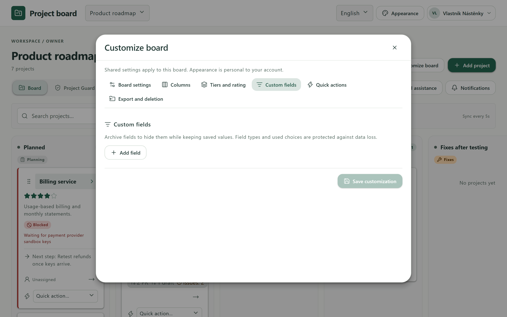
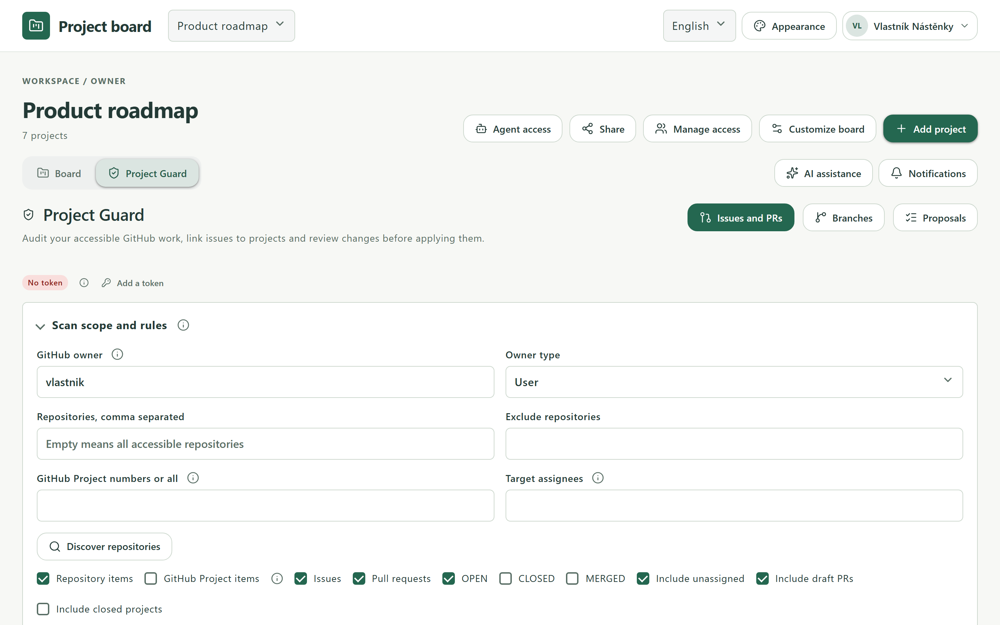
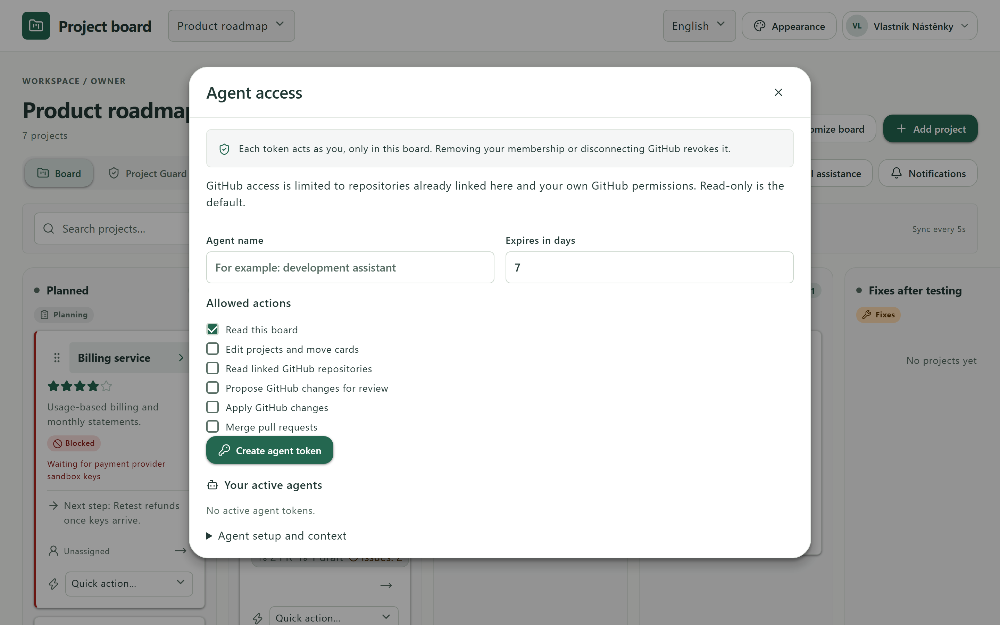
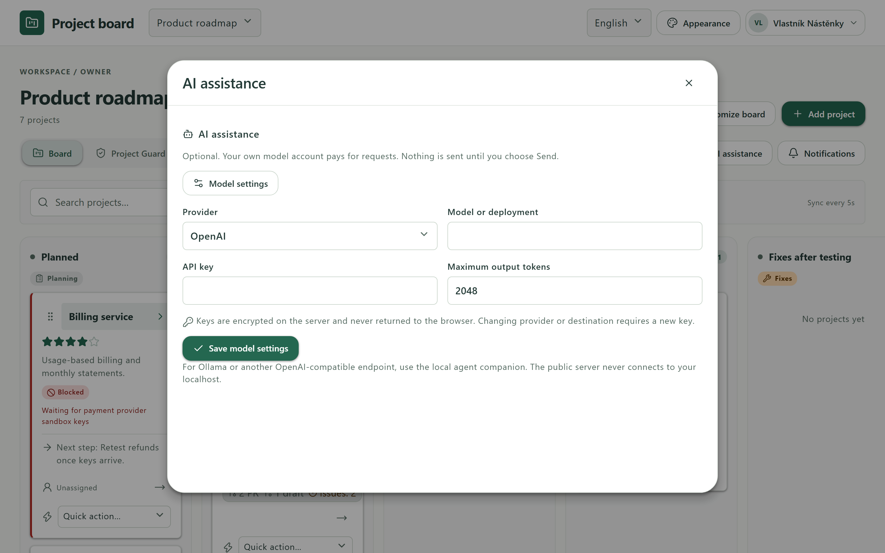
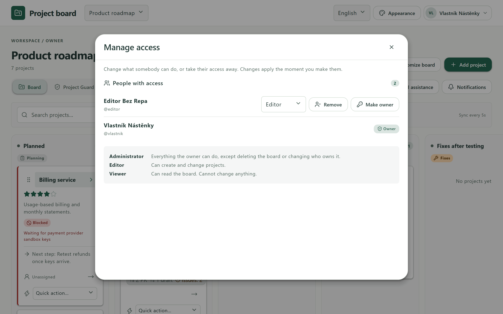
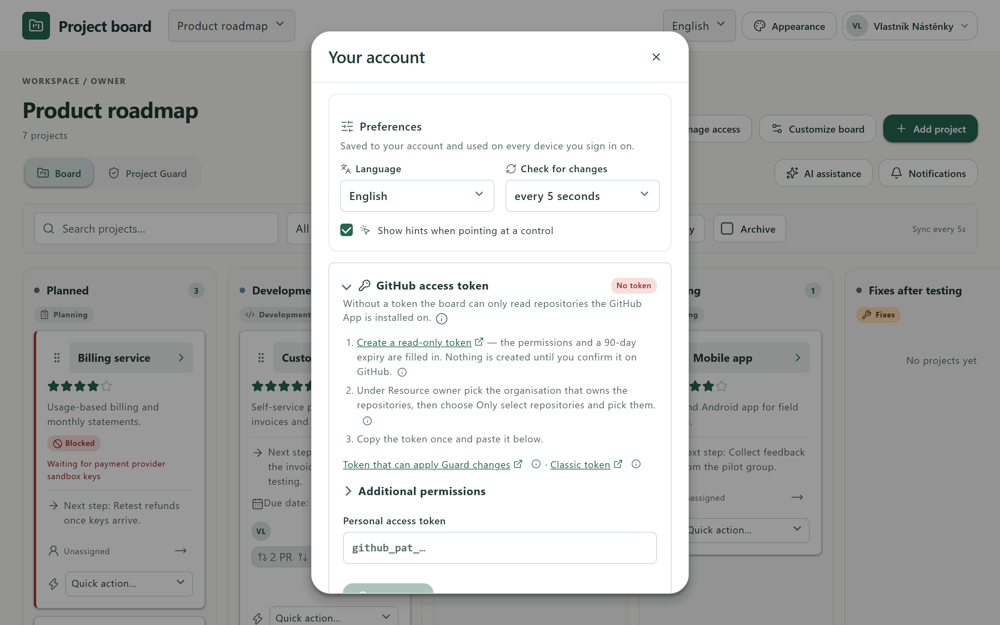

# Project board

**A private project board that keeps the phase a project is in separate from the
versions that are deployed.** Each project is one card that moves through your
own workflow columns, while its target, test and production versions stay
visible on their own, so a project can be in testing with 1.4 while 1.3 runs in
production.

<!-- Status -->
[](https://github.com/Majkey25/project-board-showcase/actions/workflows/live-check.yml)
[](https://project-board.majkeylab.workers.dev)
[](https://majkey25.github.io/project-board-showcase/)
[](LICENSE)

<!-- Stack -->
[](https://react.dev)
[](https://www.typescriptlang.org)
[](https://vite.dev)
[](https://nodejs.org)
[](https://workers.cloudflare.com)
[-F38020?logo=cloudflare&logoColor=white)](https://developers.cloudflare.com/d1/)

<!-- Quality and tools -->
[](https://vitest.dev)
[](https://playwright.dev)
[](https://eslint.org)
[](https://github.com/gitleaks/gitleaks)
[](https://docs.npmjs.com/cli/commands/npm-audit)
[](https://docs.github.com/code-security/dependabot)

<!-- Product -->
[](https://m3.material.io)
[](https://web.dev/explore/progressive-web-apps)
[](#what-it-does)
[](#what-it-does)
[](#security-and-privacy)

- **Live app:** https://project-board.majkeylab.workers.dev (sign in with GitHub)
- **Project page:** https://majkey25.github.io/project-board-showcase/

This repository is a showcase: documentation and screenshots only. The source
code is private.


*All screenshots show a synthetic demo board.*

## What it does

**Boards and projects**
- Private boards with editable workflow columns, each mapped to a stage such as
  planning, development, testing, production or done.
- Projects carry a summary, description, next step, owner, due date, blocking
  reason, target, test and production versions, a checklist, notes, a 1–5 star
  priority, custom fields, tiers and ratings, plus a full change history.
- A project overview built for scanning: status, next step, the key facts,
  checklist progress and what is open on GitHub, at a glance.
- Drag and drop, keyboard moves, search and filters by person, priority, tier
  and blocked state. Conflict-safe saving when two people edit at once.

**Working together**
- Owner, administrator, editor and viewer roles. Administrators can do
  everything except delete the board or change who owns it.
- Invite people by GitHub username or with invitation links that can expire,
  have a use limit and be revoked. Ownership can be transferred.
- Custom notifications: choose exactly which events notify you (added, edited,
  moved, reached Done, blocked, assigned to you, due date changed, …).
- Quick actions apply several changes at once, and **automations** run one
  whenever a project enters a chosen column.
- Export and import of board data as JSON.

**GitHub, agents and AI**
- Link repositories to projects and see their pull requests, issues and
  branches. Each person sees only what their own GitHub account can see.
- **Project Guard** audits the issues and pull requests you can access against
  rules you set, and prepares changes you review before anything is applied.
- **Agent access:** scoped, expiring API tokens with a documented API, so AI
  agents and scripts can read or update a board without ever exceeding the
  permissions of the person who created them.
- **AI assistance** with your own OpenAI or Azure OpenAI key. You choose what
  context is sent; nothing is sent by just opening a board.

**Experience**
- Six built-in themes, each with a light and a dark palette, plus a custom one.
- English and Czech. Hover hints explain every control and can be switched off.
- Works on phones and installs as an app from the browser.

## Screenshots

| | |
| --- | --- |
|  |  |
| **Project overview**: status, next step, facts and checklist progress | **GitHub**: open pull requests and issues, per repository |
|  |  |
| **Editing**: every field of a project in one form | **Branches** and their protection |
|  |  |
| **Quick actions and automations** | **Custom fields**, tiers and ratings |
|  |  |
| **Custom notifications** | **Project Guard** audit scope and rules |
|  |  |
| **Agent access**: scoped, expiring tokens | **AI assistance** with your own model |
|  |  |
| **Roles and sharing** | **Preferences** and your own GitHub token |
|  |  |
| **Dark theme** (Midnight) | **Hover hints** in the app's language |

<p align="center"></p>

## How it is built

- **Frontend:** React 19, TypeScript (strict) and Vite, following Material
  Design 3 tokens, with a service worker for installation.
- **Backend:** a Cloudflare Worker with a JSON API and Cloudflare D1 (SQLite).
- **Sign-in:** a GitHub App (OAuth with PKCE); optional personal tokens for
  wider GitHub access, used only for the person who saved them.

## Quality checks

Every change to the private source passes these checks in CI before it can be
merged:

| Check | Tool |
| --- | --- |
| No secrets anywhere in the history | gitleaks |
| Lint | ESLint with typescript-eslint |
| Types | strict TypeScript, web app and Worker |
| Backend tests | Vitest in workerd with D1 and a mock GitHub |
| Encrypted backup, SQLite restore and content migration | Node test runner |
| Production build | Vite |
| Browser end-to-end tests | Playwright |
| Dependencies | npm audit (high severity) |

This repository runs its own public [**Live check**](.github/workflows/live-check.yml)
every day and on every change: the live app answers and reports ready, keeps
its security headers, refuses anonymous access to boards, and this page and
every image it shows are published.

### Check it yourself

```sh
curl -s https://project-board.majkeylab.workers.dev/api/health
# {"ok":true}

curl -sI https://project-board.majkeylab.workers.dev/ | grep -iE "content-security-policy|strict-transport-security"

curl -s -o /dev/null -w "%{http_code}\n" https://project-board.majkeylab.workers.dev/api/boards
# 401: boards are private without sign-in
```

## Security and privacy

- Board content is encrypted at rest with AES-256-GCM. The keys live outside
  the database, so a leaked database dump does not reveal board content. This
  is server-side encryption, not end-to-end encryption.
- GitHub tokens are encrypted and never sent back to the browser. Every GitHub
  read uses the visitor's own access, so sharing a board never shares anyone's
  GitHub permissions.
- Strict Content Security Policy, HSTS, same-origin checks, rate limits and
  database-level guards against stale or unencrypted writes.
- Agent tokens are stored only as hashes, limited to one board and to an
  explicit list of operations, and every agent change is recorded.
- Project Guard results and proposals are personal and never shared.

## Status

A working pilot. The live app is open for sign-in with GitHub; boards are
private to their members. It is provided as is, under the terms of use shown
in the app.

## Licence

Proprietary. All rights reserved. See [LICENSE](LICENSE). The source code is
not published.

---

Made by [Matěj Teplý](https://github.com/Majkey25).
